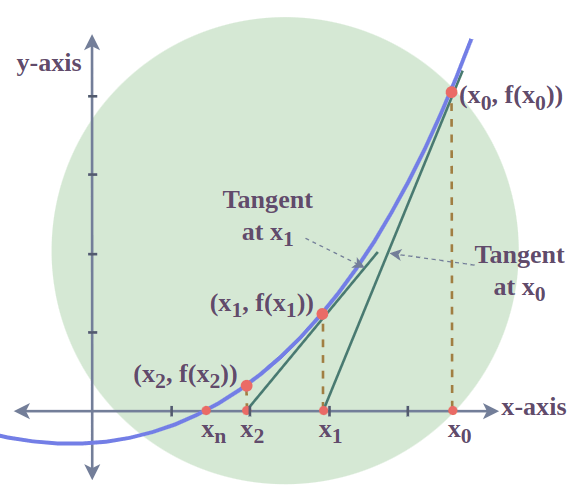

### Bisection Method

Plot the complex function. From there, identify the range \[a,b\] where in which the gradient changes, min or max lies. Calculate the midpoint of that range: $m = (a_0+b_0)/2$ Now your plot is divided in half, check if the gradient changes in $[a_0; m]$, if it does, then the max/min lies in this interval, other wise it lies in $[m, b_0]$. Repeat this process until the new interval is less than some super small tolerance level $\epsilon$

### Newtons Method

{width="283"}

Have a non-linear curve, draw a tangent line at current point $x_k$ see where said line crosses x-axis, the crossing becomes new guess $x_{k+1}$

$x_{k+1} = x_k - f'(x_k)/f''(x_k)$

Is $$|x_{k+1} - x_k|$$ small? If not repeat.

### Nonlinear Gauss-Seidel

Solve one variable at a time. Update x using the old y, update y using new x, repeat.

### Question 1

```{r}
#Generated random values to pass to gox
x <- seq(1, 10, 0.01)
gox <- log(x)/ (1+x)

plot(x, gox, type = "l", col = "red", lwd = 2)
```

```{r}
#Derivative of gox
gprime <- function(x){
  deriv <- (1 + (1/x) - log(x))/((1+x)^2) #derivative of gox
  return (deriv)
}
```

```{r}
a  <- 1
b <- 7
tolerance <- 0.0001
```

```{r}
bisec <- function(gprime, a, b, tol = 0.0001){
  
  while ((b-a)/2 > tol){ #so whilst the distance between a and b > tol continue the loop
    c <- (a+b)/2 #calculates midpoint
    if (abs(gprime(c)) < tol){ #if the gradient eval at midpt < tol
      return (c)
    }
    
    if (gprime(a) * gprime(c) <= 0){ #if true, their signs differ, root is then between [a,c]
      b <- c
      }
    else {
      a <- c #interval [c,b]
    }
    
  }
  return ((a+b)/2) #new midpt = root fn
   
}

bisec(gprime, a= 1, b= 7, tol = tolerance)
```

```{r}
#Check answer
uniroot(gprime, c(1,7), tol = 0.0001)
```

### Question 2

#### 2.1 & 2.2

```{r}
counts <- c(3,1,1,3,1,4,3,2,0,5,0,4,2) #date from poisson distr

poi_likelihood <- function(lambda, x){ 
 n <- length(x)
 likelihood <- prod(dpois(x, lambda, log = FALSE)) #likelihood is the product of the individual probabilities 
 return(likelihood)
}
```

```{r}
lambda_vals <- seq(0, 6, length.out = 5000) #create lambda values, essentially x

likelihood_vals <- lapply(lambda_vals, poi_likelihood, x = counts) #for each lambda val, calculate the corrensponding likelihood values, essentially y

plot(lambda_vals, likelihood_vals, type = "l", col = "hotpink", lwd = 2)
```

#### 2.4

```{r}
poi_loglikelihood <- function(lambda, x){
 #n <- length(x)
 neg_loglikelihood <- -(sum(dpois(x, lambda, log = TRUE))) #calculate -ve loglikelihood
 return(neg_loglikelihood)
}

#By default optim performs minimization, by setting fnscale = -1, you are telling it to maximise

result <- optim(par = 1,
                fn = poi_loglikelihood,
                x = counts,
                method = "Brent",
                lower = 1e-8,
                upper = 10)

result$par #return the optimum value for theta that makes data most probable


mle_nlm <- nlm(f = poi_loglikelihood, p = 1, x= counts
    ) #chose p=1 from plot
mle_nlm$estimate


```

##### 2.230768 is the optimum lambda value

#### 2.5

```{r}
n <- length(counts)
sum_x <- sum(counts)

# First derivative of log-likelihood
score <- function(lambda) {
  sum_x / lambda - n
}

# Second derivative of log-likelihood
hessian <- function(lambda) {
  -sum_x / lambda^2
}

# Newton's method
newton_poisson <- function(lambda_init, tol = 1e-10, max_iter = 100) {
  lambda <- lambda_init
  
  for (i in 1:max_iter) {
    step <- score(lambda) / hessian(lambda) #first deriv/ second deriv
    lambda_new <- lambda - step
    
    cat(sprintf("Iteration %d: lambda = %.10f\n", i, lambda_new))
    
    if (abs(lambda_new - lambda) < tol) {
      cat(sprintf("\nConverged in %d iterations.\n", i))
      return(lambda_new)
    }
    lambda <- lambda_new
  }
  warning("Did not converge")
  return(lambda)
}
```

#### 2.6

```{r}
plot(lambda_vals, likelihood_vals, type = "l", col = "hotpink", lwd = 2)
abline(v= newton_poisson(1), col= "orange", lwd = 2)
```

#### 2.7

g(x ) = g(a)+(x −a)g′(a)+(x −a)2 g′′(a) 2!

```{r}
poi_loglikelihood <- function(lambda, x){
  sum(dpois(x, lambda, log = TRUE)) #calculate -ve loglikelihood
}

lambda_hat <- mean(count)
SE <- sqrt(-1 / hessian(lambda_hat))

lambda_0 <- 1.5

lambda_vals <- seq(0, 6, length.out = 5000) #create lambda values, essentially x
likelihood_vals <- lapply(lambda_vals, poi_likelihood, x = counts) #for each lambda val, calculate the corrensponding likelihood values, essentially y

quad_approx <- function(lambda) {
  poi_loglikelihood(lambda_0, counts) +
    score(lambda_0) * (lambda - lambda_0) +
    0.5 * hessian(lambda_0) * (lambda - lambda_0)^2
}
quad_vals <- sapply(lambda_vals, quad_approx)

plot(lambda_vals, likelihood_vals,
     type = "l", lwd = 2, col = "pink",
     xlab = expression(lambda), ylab = "Log-likelihood",
     main = "Poisson Log-Likelihood with Quadratic Approximation",
     ylim = range(c(likelihood_vals, quad_vals)))

lines(lambda_vals, quad_vals, lwd = 2, col = "red", lty = 2)

# Mark lambda_0 (expansion point)
abline(v = lambda_0, col = "orange", lty = 3)
```

### Question 3

$$
Y_i ~ Poisson(\lambda_i) 
$$ $$
\lambda_i = \alpha + \beta*x_i
$$

#### 3.1

```{r, warning=FALSE}
y <- c(2,4,3,0,1,4,3,6,10,7) #data from poi distr, count data
x <- c(0.49909145, 1.24373850, 0.34376255, 0.03833630, 0.09699331, 
       0.19469526, 0.21237902, 1.56276200, 1.56909233, 1.88487024)

poi_loglikelihood <- function(lambda, y, x){ #lambda is a vector of parameters, alpha and beta
 alpha <- lambda[1]
 beta <- lambda[2]
 lambda <- alpha + beta*x
 loglikelihood <- -sum(dpois(y, lambda, log = TRUE)) 
 #return(loglikelihood)
}


mle_nlm <- nlm(f = poi_loglikelihood, p = c(1,1), y = y, x=x, hessian = T)
print(mle_nlm)
cat("alpha estimate:", mle_nlm$estimate[1],
    "beta estimate:", mle_nlm$estimate[2], sep = "\n")

#how to get se

```

#### 3.2

Updates one parameter at a time

```{r, warnings = FALSE}
poi_loglikelihood <- function(alpha, beta, y, x){ #lambda is a vector of parameters, alpha and beta
 #alpha <- lambda[1]
 #beta <- lambda[2]
 lambda <- alpha + beta*x
 if (any(lambda <=0)) return (-Inf)
 sum(dpois(y, lambda, log = TRUE)) 
 #return(loglikelihood)
}

#Non-Linear Gauss-Seidel algorithm
gauss_seidel_mle <- function(log_lik_fn, y, x,
                              init  = c(alpha = 1, beta = 0),
                              tol   = 1e-8,
                              maxit = 1000) {
  params <- init
  
  for (iter in seq_len(maxit)) {
    params_old <- params
    
    # --- Step 1: Optimize alpha, holding beta fixed ---
    opt_alpha <- optimize(
      f        = function(a){
        log_lik_fn(alpha = a, beta = params["beta"], y = y, x = x)},
      interval = c(1e-6, 1e4),   # must stay positive for Poisson
      maximum  = TRUE
    )
    params["alpha"] <- opt_alpha$maximum
    
    # --- Step 2: Optimize beta, holding alpha fixed ---
    opt_beta <- optimize(
      f        = function(b){ log_lik_fn(alpha = params["alpha"], beta = b, y = y, x = x)},
      interval = c(-1e4, 1e4),
      maximum  = TRUE
    )
    params["beta"] <- opt_beta$maximum
    
    # --- Convergence check ---
    delta <- max(abs(params - params_old))
    if (delta < tol) {
      message(sprintf("Converged in %d iterations (delta = %.2e)", iter, delta))
      return(list(alpha = params["alpha"], beta = params["beta"],
                  iterations = iter, converged = TRUE))
    }
  }
  
  warning("Did not converge within maxit iterations")
  list(alpha = params["alpha"], beta = params["beta"],
       iterations = maxit, converged = FALSE)
}
```

```{r}
res <- gauss_seidel_mle(
  log_lik_fn = poi_loglikelihood, 
  y = y, 
  x = x,
  init = c(4, beta = 0)
)

print(res)
```
